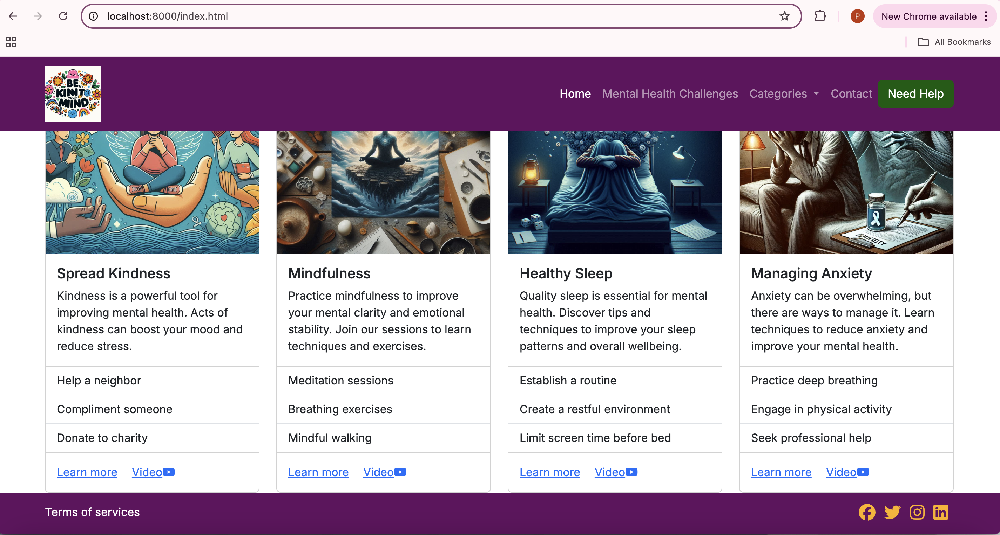
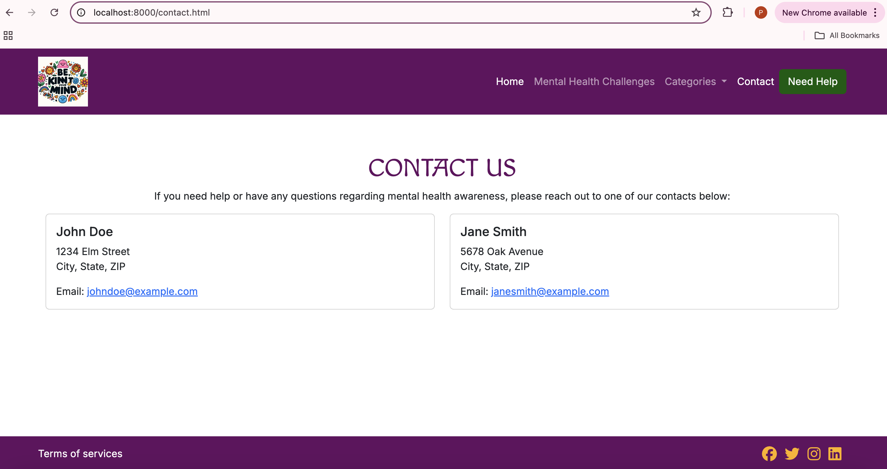
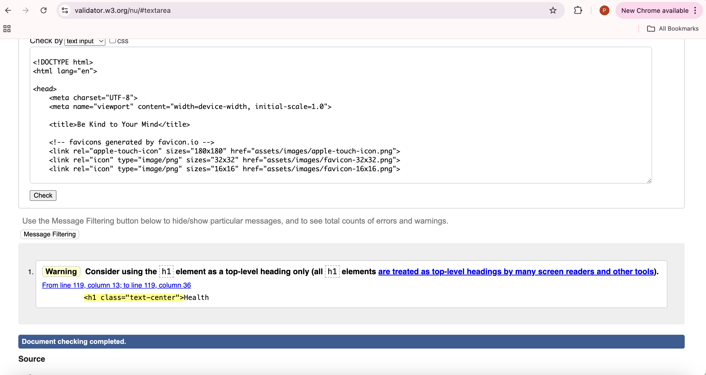

# [Be Kind To Your Mind](https://praptitambe.github.io/Be-Kind-to-Your-Mind/)

## Introduction

Be Kind To Your Mind is a simple yet stunningly effective web application powered by HTML, CSS and Bootstrap. It was designed with the purpose of promoting mental health awareness and providing resources and support for individuals struggling with mental health issues. The website aims to create a supportive community where individuals can find information, share experiences, and seek help. Key features of the website include:
- Importance of mental health
- Different categories of menatl health with there description
- Need help button for urgent help
- Methods to improve mental health

If the user so desires, they can view additional details about the event which will provide them

## Purpose of Mental Health Awareness Website

The purpose of the "Be Kind To Your Mind" website is to promote mental health awareness and provide resources and support for individuals struggling with mental health issues. The website aims to:

- **Educate:** Provide information about various mental health conditions, their symptoms, and treatment options.
- **Support:** Offer resources and support for individuals seeking help, including contact information for mental health professionals and support groups.
- **Encourage:** Promote self-care and mindfulness practices to help individuals manage stress and improve their mental wellbeing.
- **Advocate:** Raise awareness about the importance of mental health and advocate for better mental health services and support.

By providing clear, concise, and accurate information, the "Be Kind To Your Mind" website aims to empower individuals to take control of their mental health and seek the help they need.

## UX

### Design Thinking

I thought of creating a website with easy accesibl content regarding mental health.So I created a website with following components

- Navigation bar with logo and links to different parts of the page.
- Need help button for those who need urgent help, it opens a modal with a form.
- Dropdown list for different categories of mental health problems.

### Colour Scheme

- `#640D5F`: a dark purple color used for navbar,footer and headings.
- `#D91656`: a dark-pink color used for text in modal.
- `#EB5B00`: Orange color used as secondary color for custom buttons and social links when hovered.
- `#FFB200`: Light yellow color used as highlight-color-light to highlight social links .
- `rgb(6, 91, 6)`: Green color for need help button

I used [colorhunt.co](https://colorhunt.co/palette/640d5fd91656eb5b00ffb200) to generate my colour palette:

### Typography

- I used [Inter](https://fonts.google.com/specimen/Inter) for the main body text of the website. 
- I used [Macondo](https://fonts.google.com/specimen/Macondo) for titles and headings.

- I used [Font Awesome](https://fontawesome.com) icons for the footer, allowing me to present links to social media platforms in a succinct manner.

## User Stories

- As a user I want to access articles research about mental health topics,
so that I can better understand mental health conditions, symptoms, and treatment options.
- As a visitor to the website,I want to view a dedicated page that highlights selected mental health issues,so that I can easily access information about specific conditions and understand their symptoms, causes, and treatments.
- As a person experiencing a mental health crisis,I want to find a list of emergency helplines and crisis intervention contacts, so that I can get immediate help if I need it.

- As a First-Time Visitor, I need easy navigation and a user-friendly design, including a responsive layout for my device, so I can find information quickly and efficiently without frustration.

## Wireframes

 I kept my wireframes simple and used them as the foundation from which to build my final product. I wanted users to see a grid format of challenges when the page first loaded:
- Four challenges per row on Desktop
- Two challenges per row on tablet
- One challenge per row on mobile

This manner of approach would ensure that users would receive precisely the information they came to the site for.

I used [Balsamiq](https://balsamiq.com/wireframes) to design my site wireframes.

### Mobile Wireframe

### Tablet Wireframe

### Desktop Wireframe

## Features

### Existing Features

- **Navbar**

  - The Navbar contains a navigation menu with the following links:
    - Home
    - Mental health challenges
    - Categories
    - Contact
    - Need Help

  *Navbar*
  

  *Expanded Navbar*
  

- **Home Page**

  - Home page consists of navbar with mental health challenges link, when we click on it we can move down on the page in the relevant section.

   

   - On home page when clicked on need help button a modal with form is displayed to enter your information and get help.

   

   - In mental health challenges section user can go on to individual problems and click on learn more link and it will take you to new page of same problem.

   - In same problem section user can clink on video link to watch youtube video of relevant problem.

   - On home page when clicked on contact link user will be redirected to conct us page.

- **Grid Display**

  - A grid display was my priority. It ensured that everything would be displayed neatly and, with the help of media queries, responsively.

    

    

    

- **Footer**

  - A simple, responsive footer displaying social links and copyright text is presented in the footer.

    

### Future Features
- Offering Self-Care Tools

- Develop a set of downloadable self-care worksheets (e.g., mood trackers, journaling prompts).

- Create an interactive self-assessment tool (e.g., a quiz for users to assess their mental health).

- Design a self-care resources page that provides downloadable resources and tool recommendations.

- Implement a sign-up feature to send users regular self-care tips via email.

## Site Responsiveness

The following screenshots will demonstrate the responsiveness of the site across multiple screen sizes.

**PC Desktop (1440px+)**

*Home Page*

*Health challenges pages*

*Contact Us Page*

**Tablet (768px)**

*Home Page*

*Health challenges pages*

*Contact Us Page*

**Mobile Screen (375px)**

*Home Page*

*Health challenges pages*

*Contact Us Page*

## Tools & Technologies Used

- [HTML](https://en.wikipedia.org/wiki/HTML) used for the main site content.
- [CSS](https://en.wikipedia.org/wiki/CSS) used for the main site design and layout.
- [CSS Flexbox](https://www.w3schools.com/css/css3_flexbox.asp) used for an enhanced responsive layout.
- [CSS Grid](https://www.w3schools.com/css/css_grid.asp) used for an enhanced responsive layout.
- [JavaScript](https://www.javascript.com) used for user interaction on the site.
- [Git](https://git-scm.com) used for version control. (`git add`, `git commit`, `git push`)
- [GitHub](https://github.com) used for secure online code storage.
- [Gitpod](https://gitpod.io) used as a cloud-based IDE for development.
- [Bootstrap](https://getbootstrap.com) used as the front-end CSS framework for modern responsiveness and pre-built components.
## Agile Development Process

### GitHub Projects

I used [GitHub Projects](https://github.com/users/praptitambe/projects/6) to keep track of my issues relating to fixes, features, and user stories.

## Testing

- HTML validation

- CSS validation

- Lighthouse Report

## Deployment

The live deployed application can be found deployed on [Github](https://praptitambe.github.io/Be-Kind-to-Your-Mind/).

## Credits

- [Readme Editor](https://readme.so/editor) for creating my README.md 
- [Chat GPT](https://chat.openai.com/) for simple debugging
- [Stack Overflow](https://stackoverflow.com/) for debugging more complex issues
- [W3Schools](https://www.w3schools.com/) for teaching me Django tricks, like creating a custom 404 page
- [Am I Responsive](https://ui.dev/amiresponsive) for my banner screenshot
